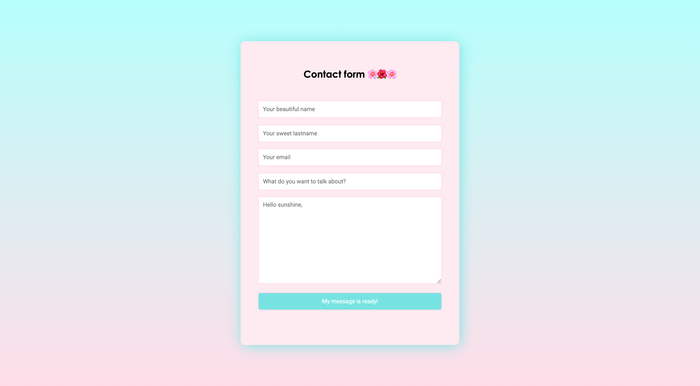

# form-front-LeReacteur

🗓 April 2021.  
🪄 Frontend - contact form.  
👀 Backend - look at the backend repo!  
👉🏻 Check [that](https://myform-lereacteur-2021.netlify.app/)

## Welcome in my school exercice (contact form) 🌸🌺🌸

### My work?

To code the frontend (and also the backend ➡️ look at the repo!) of a contact form (I love colors 🌈)

## Languages

HTML5, CSS3 & Vanilla JS.

🙏🏻 Thank you @LeReacteur.
